# 🌐 Cloudflare Navigator

<div align="center">


**A powerful, modern microservices-based application for managing Cloudflare DNS records and tunnels**

[🚀 Live Demo](https://dnsportal.endusercompute.in) • [📚 Documentation](#features) • [🐳 Docker Hub](https://hub.docker.com/u/jsrankit) • [☕ Buy me a coffee](#support)

</div>

---

## ✨ Features

### 🎯 Core Functionality
- **DNS Management** - Full CRUD operations for Cloudflare DNS records
- **Tunnel Management** - Complete Cloudflare tunnel configuration and monitoring
- **Multi-Account Support** - Seamlessly switch between multiple Cloudflare accounts
- **Real-time Updates** - Auto-refresh capabilities with live data synchronization
- **Bulk Operations** - Efficient batch processing for DNS records

### 🎨 User Experience
- **Modern UI/UX** - Clean, intuitive interface built with Radix UI
- **Responsive Design** - Mobile-first approach with seamless cross-device experience  
- **Theme Support** - Beautiful light/dark mode with custom color schemes
- **Advanced Filtering** - Powerful search and filter capabilities
- **Toast Notifications** - Real-time feedback for all operations

### 🔒 Security & Performance
- **SSL/TLS Support** - Full HTTPS encryption for both frontend and backend
- **Secure API Proxy** - Backend acts as secure proxy to Cloudflare API
- **Credential Management** - Secure local storage of API credentials
- **Performance Optimized** - Built with Vite for lightning-fast development and builds

---

<div align="center">

### ☕ Buy Me a Coffee

If this project helped you, consider supporting its development!

[](https://buymeacoffee.com/jsramitkumar)

**Your support helps maintain and improve this project! 🙏**

</div>

## 🏗️ Architecture

```mermaid
graph TB
    U[👤 User] --> F[🎨 Frontend<br/>React + TypeScript]
    F --> B[🚀 Backend<br/>Express.js API]
    B --> CF[☁️ Cloudflare API]
    
    F -.-> HTTPS1[🔒 HTTPS<br/>Port 8443]
    B -.-> HTTPS2[🔒 HTTPS<br/>Port 3443]
    
    subgraph "🐳 Container Environment"
        F
        B
    end
    
    subgraph "☸️ Kubernetes Cluster"
        K8S_F[Frontend Pod]
        K8S_B[Backend Pod]
        NGINX[Nginx Ingress]
    end
    
    NGINX --> K8S_F
    NGINX --> K8S_B
```

<div align="center">



</div>

### 🏢 Microservices Architecture

| Service | Technology Stack | Purpose | Port |
|---------|------------------|---------|------|
| **Frontend** | React 18, TypeScript, Vite, Tailwind CSS | User Interface & Experience | 8080/8443 |
| **Backend** | Node.js, Express.js, Axios | API Proxy & Business Logic | 3001/3443 |

---

## 🚀 Quick Start

### 📋 Prerequisites

- **Node.js** 18+ and npm
- **Docker** & Docker Compose (for containerized deployment)
- **Kubernetes** cluster (for K8s deployment)
- **Cloudflare API credentials** (API Key, Email, Account ID, Zone ID)

### 💻 Development Setup

#### 1. Clone the Repository
```bash
git clone https://github.com/jsramitkumar/cloudflare-navigator-tool.git
cd cloudflare-navigator-tool
```

#### 2. Setup Frontend
```bash
cd FE/
npm install
npm run dev
```
🌐 Frontend available at: `http://localhost:5173`

#### 3. Setup Backend  
```bash
cd BE/
npm install
npm run dev
```
🚀 Backend available at: `http://localhost:3001`

#### 4. Environment Configuration

**Frontend (.env.local)**
```env
VITE_BACKEND_URL=http://localhost:3001
```

**Backend (.env)**
```env
NODE_ENV=development
PORT=3001
HOST=0.0.0.0
API_URL=https://api.cloudflare.com/client/v4
```

---

## 🐳 Docker Deployment

### 🔧 Using Docker Compose (Recommended)

```bash
# Start all services
docker-compose up -d

# View logs
docker-compose logs -f

# Stop services  
docker-compose down
```

### 🏗️ Manual Docker Build

```bash
# Build images
docker build -t cloudflare-navigator-fe ./FE
docker build -t cloudflare-navigator-be ./BE

# Run with SSL support
docker run -p 8080:8080 -p 8443:8443 \
  -v ./ssl:/app/ssl:ro \
  cloudflare-navigator-fe

docker run -p 3001:3001 -p 3443:3443 \
  -v ./ssl:/app/ssl:ro \
  cloudflare-navigator-be
```

### 📦 Pre-built Images

Pull directly from Docker Hub:
```bash
docker pull jsrankit/cdm-ui:latest
docker pull jsrankit/cdm-server:latest
```

---

## ☸️ Kubernetes Deployment

### 🚀 Using ArgoCD (GitOps)

```bash
# Apply ArgoCD application
kubectl apply -f argocd/argocd-application.yaml
```

### 🔧 Manual Kubernetes Deployment

```bash
# Create namespace
kubectl create namespace cdm-system

# Apply all resources
kubectl apply -f k8s/

# Check deployment status
kubectl get pods -n cdm-system
kubectl get services -n cdm-system
kubectl get ingress -n cdm-system
```

### 🌐 Access URLs

- **Frontend**: https://dnsportal.endusercompute.in
- **Backend API**: https://cdm-api-server.endusercompute.in

---

## 🔒 SSL/TLS Configuration

### 📜 Certificate Setup

1. **Obtain SSL certificates** (Let's Encrypt recommended)
2. **Place certificates** in `./ssl/` directory:
   ```
   ssl/
   ├── fullchain1.pem
   └── privkey1.pem
   ```

### ⚙️ SSL Environment Variables

```env
SSL_ENABLED=true
SSL_CERT_PATH=/app/ssl/fullchain1.pem
SSL_KEY_PATH=/app/ssl/privkey1.pem
SSL_PORT=8443  # Frontend
SSL_PORT=3443  # Backend
```

---

## 🛠️ Configuration

### 🔑 Cloudflare API Setup

1. **Get API credentials** from Cloudflare dashboard
2. **Configure in application**:
   - API Key
   - Email address
   - Account ID
   - Zone ID

### 📊 Monitoring & Health Checks

Both services include:
- **Readiness probes** - TCP socket checks
- **Liveness probes** - Application health monitoring
- **Resource limits** - CPU and memory constraints

---

## 🔄 Version Management

- **Automated versioning** with timestamp format: `MMDDYYYY.HHMM`
- **Version display** in application footer
- **GitOps workflow** with ArgoCD for seamless deployments

---

## 🤝 Contributing

1. **Fork the repository**
2. **Create feature branch**: `git checkout -b feature/amazing-feature`
3. **Commit changes**: `git commit -m 'Add amazing feature'`
4. **Push to branch**: `git push origin feature/amazing-feature`
5. **Open Pull Request**

---

## 📝 API Documentation

### 🔌 Backend Endpoints

| Endpoint | Method | Description |
|----------|---------|-------------|
| `/api/cloudflare/test-connection` | GET | Test API connection |
| `/api/cloudflare/dns` | GET/POST/PUT/DELETE | DNS record operations |
| `/api/cloudflare/tunnels` | GET/POST/DELETE | Tunnel management |
| `/api/cloudflare/domains` | GET | List available domains |

### 🔐 Authentication Headers

```http
X-CF-API-KEY: your_api_key
X-CF-EMAIL: your_email
X-CF-ACCOUNT-ID: your_account_id
X-CF-ZONE-ID: your_zone_id
```

---

## 🐛 Troubleshooting

### Common Issues

**🔴 Connection Failed**
- Verify Cloudflare API credentials
- Check network connectivity
- Ensure backend service is running

**🔴 SSL Certificate Errors**
- Verify certificate paths
- Check certificate validity
- Ensure proper file permissions

**🔴 Kubernetes Deployment Issues**
- Check pod logs: `kubectl logs -n cdm-system <pod-name>`
- Verify ingress configuration
- Ensure secrets are properly mounted

---

## 📊 Performance

- **Build Time**: ~2-3 minutes
- **Cold Start**: <5 seconds
- **Memory Usage**: 
  - Frontend: ~256MB
  - Backend: ~512MB
- **Response Time**: <200ms (average)

---

## 🚦 Status


---

## 📄 License

This project is licensed under the **MIT License** - see the [LICENSE](LICENSE) file for details.

---

## 💖 Support

<div align="center">

### 🤝 Get Help & Support

Having issues or questions? I'm here to help!

[](mailto:jsrankit@gmail.com)
[](https://github.com/jsramitkumar/cloudflare-navigator-tool/issues)
[](https://github.com/jsramitkumar/cloudflare-navigator-tool/issues/new?template=feature_request.md)

### ☕ Buy Me a Coffee

If this project helped you, consider supporting its development!

[](https://buymeacoffee.com/jsramitkumar)

**Your support helps maintain and improve this project! 🙏**

</div>

---

<div align="center">

**Made with ❤️ by [Amit Kumar](https://github.com/jsramitkumar)**

⭐ **Star this repo if you found it helpful!** ⭐

</div>
